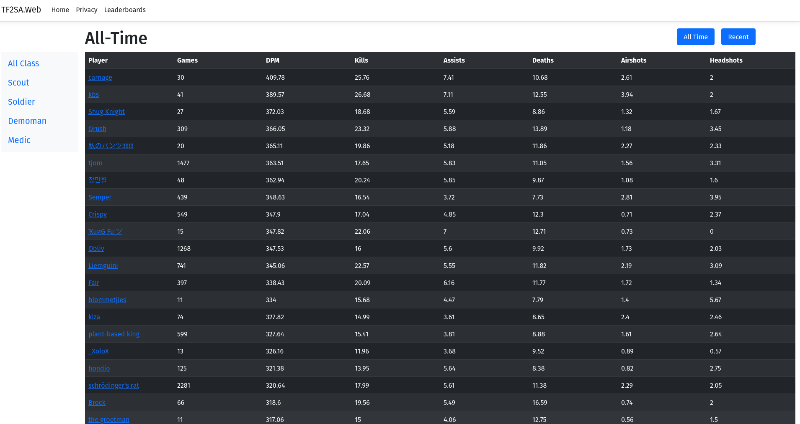

# tf2sa
A collection of resources for tf2sa.

# run project
Environments running the solution require the following configuration injected as environment variables
- TF2SA_MYSQL_HOST
- TF2SA_MYSQL_USR
- TF2SA_MYSQL_PWD
- TF2SA_MYSQL_DB
- TF2SA_STEAM_API_KEY

# Project description

Data extraction from the logs.tf API is done through a python script which inputs the data into a MariaDB database. This data is then used in the ASP.NET Web Application that we have created to be able to properly display player performance statistics to all those who are interested.

